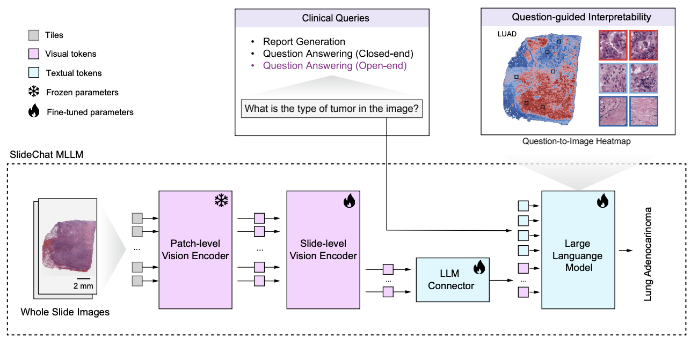

# SlideChat: A Multimodal Generative AI Assistant for Whole-Slide Computational Pathology


> **Note**
>
> This repository provides the official code for SlideChat. The expanded study, published in *Nature Cancer*, substantially extends our original CVPR 2025 work with a larger instruction dataset, broader expert-reviewed evaluation, and additional pathology tasks across cancer types.


# Release

We release **SlideChat**, **SlideInstruction**, and **SlideBench** as open-source resources, hoping to facilitate research and development in computational pathology.
- **SlideChat**: The first large vision-language assistant for whole-slide pathology image analysis, capable of generating comprehensive descriptions and contextually relevant responses.
- **SlideInstruction**: The largest comprehensive WSI instruction-following dataset, derived from pathology reports..
- **SlideBench**: A WSI multimodal benchmark including SlideBench-Caption/Report (TCGA, CPTAC, HISTAI) and SlideBench-Closed(VQA-TCGA, VQA-BCNB, VQA-CPTAC, VQA-HISTAI).
Before open‑sourcing, SlideBench‑VQA‑TCGA underwent a second round of expert review with pathologists, further enhancing data quality. The initial version covers 10 cancer types with 1,494 samples. **We later expanded it to 31 additional cancer types, rigorously validated by experts, yielding 3,176 samples (SlideBench‑VQA‑TCGA.csv).** SlideChat achieved an accuracy of 75.23% on the initial version and 74.12% on the expanded version.

## Installation

### Environment Setup
This project is built upon [**Xtuner**](https://github.com/InternLM/xtuner). To get started:

```bash
conda create --name xtuner-env python=3.10 -y
conda activate xtuner-env
git clone https://github.com/uni-medical/SlideChat.git
cd SlideChat
pip install -e .
```
### Dependencies
- Python >= 3.10
- [Xtuner](https://github.com/InternLM/xtuner)
- [DeepSpeed](https://github.com/microsoft/DeepSpeed)
- Pytorch

Please refer to `requirements.txt` and `environment.yaml` for the complete list of dependencies.

## Pre-requisites

Download the JSON file containing WSI IDs (TCGA) and conversation data from the [Dataset](https://huggingface.co/datasets/General-Medical-AI/SlideChat). The input image file is in CSV format and contains 512-dimensional feature representations for all patches within the WSI. Example files are provided in the ./dataset/ folder. For slide downloading and processing, please refer to [CLAM](https://github.com/mahmoodlab/CLAM) and [DSMIL](https://github.com/binli123/dsmil-wsi).

## Training

SlideChat serializes each input WSI into a sequence of patches, converting each into visual embeddings with a patch-level encoder [CONCH](https://github.com/mahmoodlab/CONCH). A slide-level encoder then interacts with these features to generate contextual embeddings. Then, a multimodal projector maps the visual features from the slide-level encoder into a unified space, aligned seamlessly with the LLM. SlideChat was trained for two stages: (1) Cross-Domain Alignment: SlideChat is trained to generate descriptive captions using WSI-caption pairs from SlideInstruction. Specifically, only the slide-level encoder and projection are updated, while the patch-level encoder and LLM weights remain fixed; (2) Visual Instruction Learning: we utilize WSI VQAs from SlideInstruction, allowing the slide encoder, projection layer, and large language model components to be fully trainable to ensure comprehensive adaptability.

<p align="center">
     <br>
</p>

Config files are in `configs/`.
```bash
NPROC_PER_NODE=${GPU_NUM} xtuner train \
 <your config file path>  \
  --deepspeed <deepspeed config file path> \
  --work-dir <workdir path>

# stage1 example
NPROC_PER_NODE=${GPU_NUM} xtuner train \
 configs/slidechat/stage_1.py \
  --deepspeed configs/deepspeed/deepspeed_zero2.json \
  --work-dir work_dirs/stage1

# stage2 example
NPROC_PER_NODE=${GPU_NUM} xtuner train \
 configs/slidechat/stage_2.py \
  --deepspeed configs/deepspeed/deepspeed_zero2.json \
  --work-dir work_dirs/stage2
```
Where ${GPU_NUM} is the number of GPUs

For a detailed explanation of the configuration file, please refer [**here**](https://xtuner.readthedocs.io/zh-cn/latest/training/modify_settings.html).
- `llm_name_or_path`: The parameter `llm_name_or_path` corresponds to the Hugging Face LLM path, such as `internlm/internlm2-chat-7b` or `Qwen/Qwen2.5-7B-Instruct` and so on.
- `data_path`: Training data (.json) path.
- `evaluation_images`: Evaluation data path.

LLAVAModel Hyperparameters:
- `freeze_llm`: Freeze the parameters of the LLM.
- `pretrained_pth`: If it is the stage 2 training , it refers to the checkpoint file from stage 1 training; otherwise, it is set to `None`.
- `train_stage`: `train_stage` indicates the training phase, either Stage `'1'` or Stage `'2'`.
  

## Inference

```bash
xtuner test <your config file path> \
--checkpoint <your checkpoint path> \
--test_slide_csv  <your test file> \
--test_output_csv <result file> \
--local_rank 0

# example
xtuner test configs/slidechat/stage_2.py \
--checkpoint stage2_pth \
--test_slide_csv  SlideBench-VQA(TCGA).csv \
--test_output_csv output_my_test.csv \
--local_rank 0
```

## Computational Resources

### Training
We trained SlideChat using **8 x NVIDIA A100 (80GB)** GPUs.

| Parameter | Stage-1 | Stage-2 |
| :--- | :--- | :--- |
| **Training GPUs** | 8 x A100 (80 GB) | 8 x A100 (80 GB) |
| **Total Training Time** | ~3 hours | ~24 hours |
| **Batch Size** | 1 | 1 |
| **Epochs** | 3 | 1 |

### Inference
SlideChat is deployment-friendly. NVIDIA A100 (80GB) is recommended for processing large slides, while a single NVIDIA RTX 4090 (24GB) is sufficient for WSIs with < 20,480 patches.

# Contact
- Ying Chen: cying2023@stu.xmu.edu.cn
- Yuanfeng Ji: yfj@stanford.edu
- Junjun He: hejunjun@pjlab.org.cn

# Citation

**BibTeX:**

```bibtex
@inproceedings{chen2025slidechat,
  title={Slidechat: A large vision-language assistant for whole-slide pathology image understanding},
  author={Chen, Ying and Wang, Guoan and Ji, Yuanfeng and Li, Yanjun and Ye, Jin and Li, Tianbin and Hu, Ming and Yu, Rongshan and Qiao, Yu and He, Junjun},
  booktitle={2025 IEEE/CVF Conference on Computer Vision and Pattern Recognition (CVPR)},
  pages={5134--5143},
  year={2025},
  organization={IEEE}
}
```
